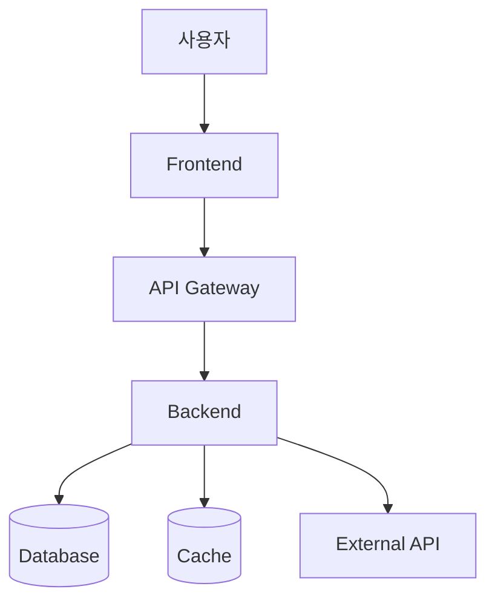
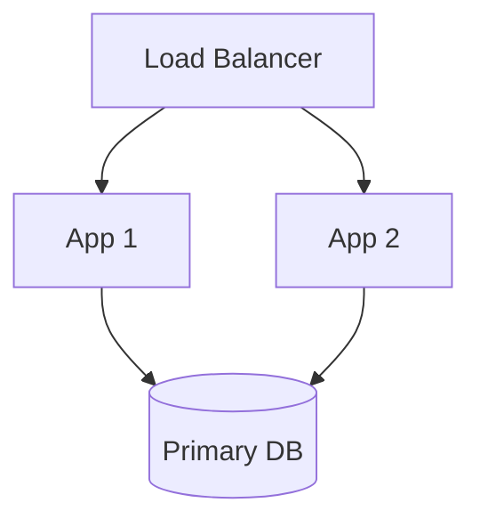

# Architecture Designer Skill

## Overview

PRD와 기술 스택을 기반으로 구현 가능한 시스템 아키텍처를 설계합니다.

## 핵심 원칙

1. **PRD + Tech Stack 기반** - 요구사항과 선택된 기술 활용
2. **실용적 설계** - 구현 가능하고 운영 가능한 아키텍처
3. **다이어그램 필수** - Mermaid로 시각화
4. **단계적 확장** - Phase별 확장 계획

## 설계 프로세스

### 1. 입력 문서 읽기

```bash
# PRD 읽기
cat docs/prd/[prd-file].md

# Tech Stack 읽기
cat docs/tech-stack/tech-stack.md
```

### 2. 시스템 컨텍스트 파악

"PRD와 Tech Stack을 분석했습니다.

**시스템 개요:**
- 목적: [PRD Section 1]
- 주요 기능: [PRD Section 5 요약]
- 기술: [Tech Stack 요약]

**외부 연동:**
- [External System 1]
- [External System 2]

설계를 시작할까요?"

### 3. High-Level Architecture 제안



"이 구조로 진행할까요? 수정 사항이 있나요?"

### 4. 컴포넌트 상세 설계

각 컴포넌트마다:
- 책임과 역할
- 내부 구조
- 인터페이스
- 데이터 플로우

### 5. API 설계

```typescript
// PRD Data Model 기반
interface SearchRequest {
  query: string;
  userId: string;
}

// Endpoints
POST /api/v1/search
GET /api/v1/documents/{id}
```

### 6. 데이터베이스 설계

PRD Section 7.2의 Data Models를 SQL 스키마로 변환:

```sql
CREATE TABLE users (
  id UUID PRIMARY KEY,
  email VARCHAR(255) UNIQUE NOT NULL,
  created_at TIMESTAMP DEFAULT NOW()
);
```

### 7. 배포 아키텍처



### 8. 문서 생성

docs/architecture/architecture.md 생성

## Best Practices

- ✅ 다이어그램 필수 (Mermaid)
- ✅ PRD Data Model 정확히 반영
- ✅ 성능/보안 고려사항 명시
- ✅ Phase별 확장 계획
- ❌ Over-engineering 지양
- ❌ 불필요한 복잡도 배제
