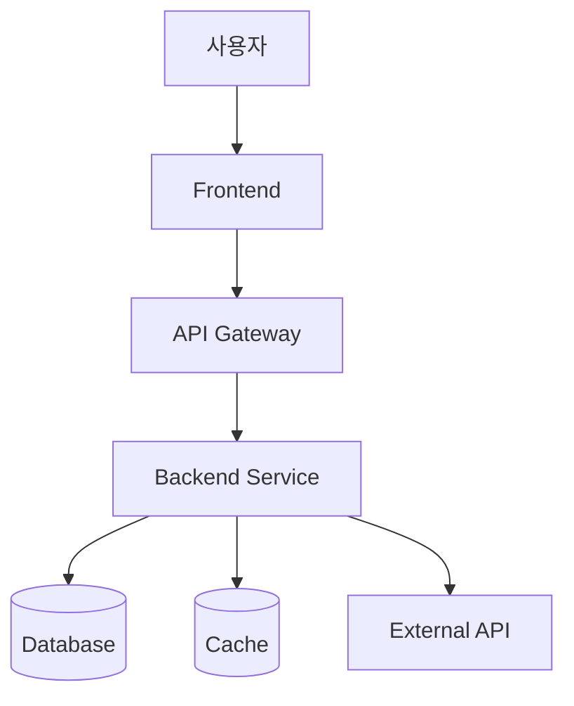
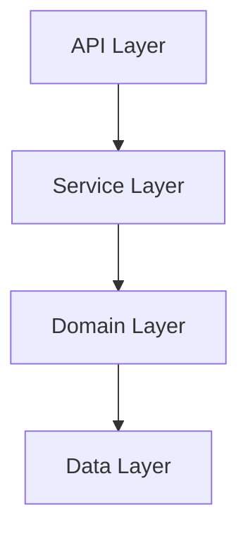
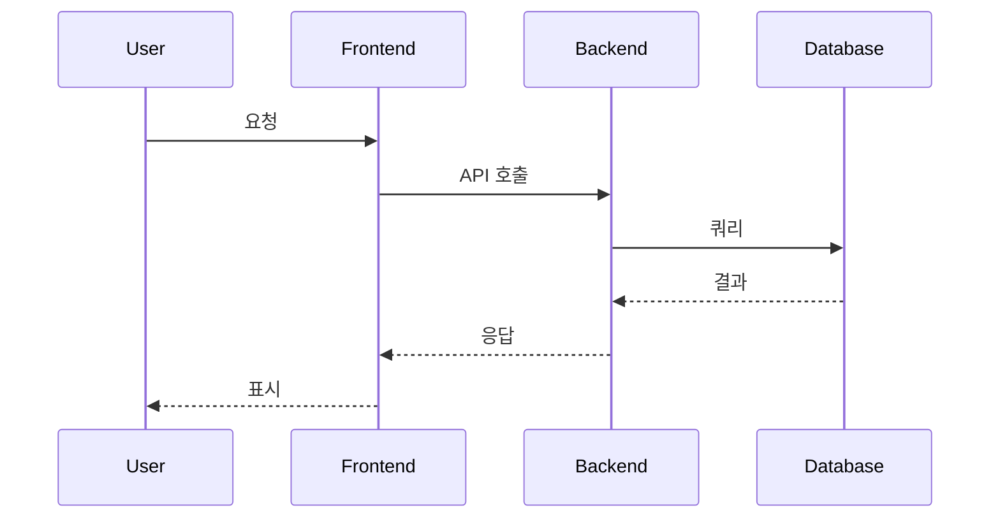
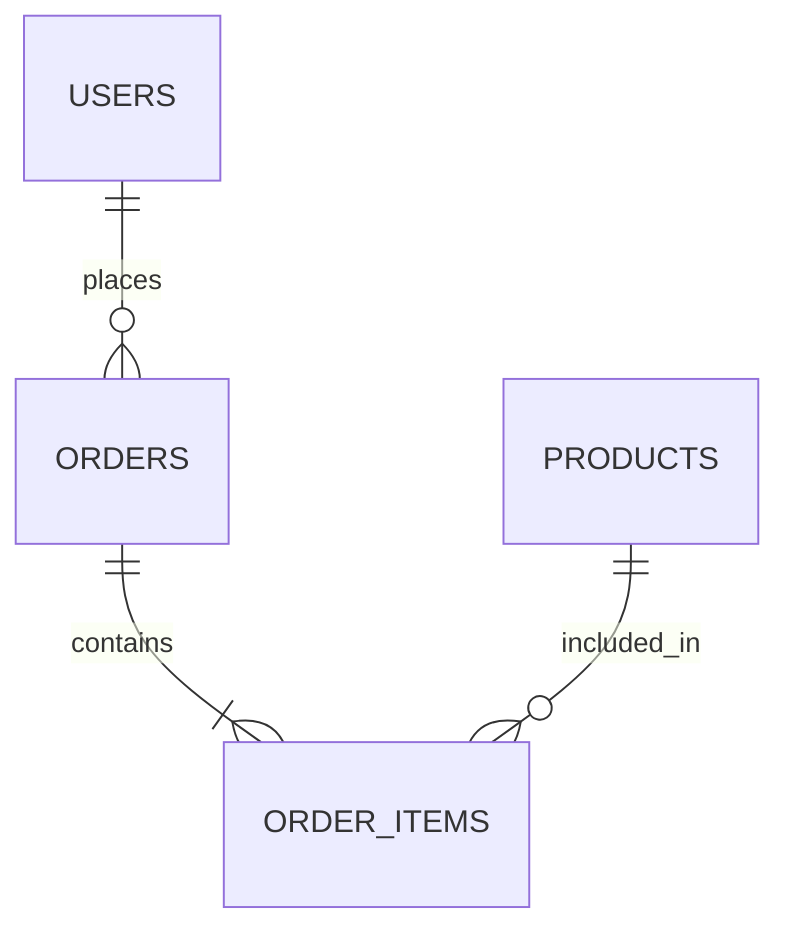
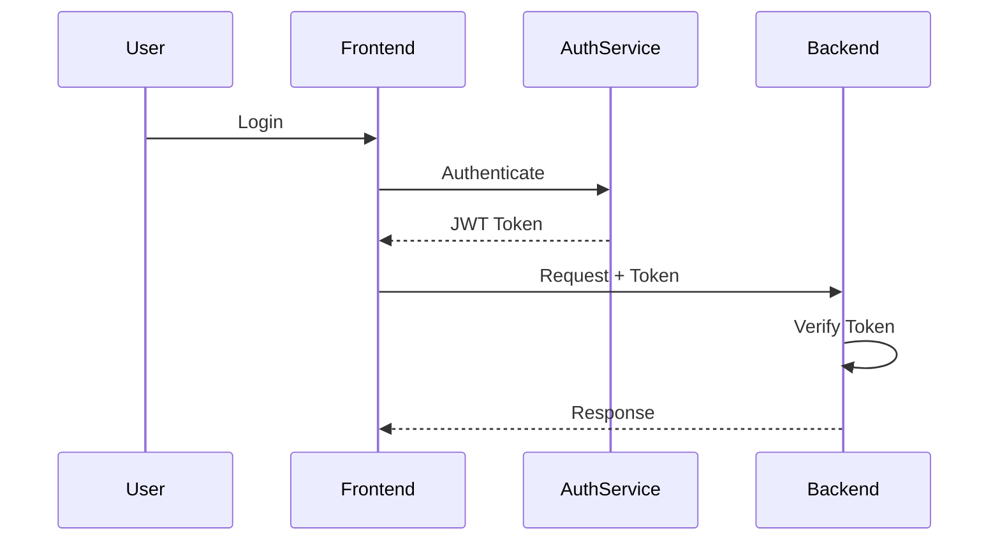
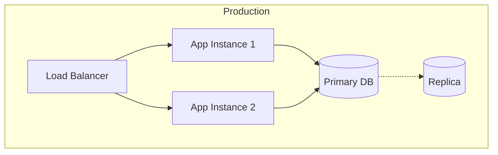

# Architecture: [Project Name]

---

## Meta
- PRD Reference: [PRD 파일명]
- Tech Stack Reference: [Tech Stack 파일명]
- Design Date: [날짜]
- Architects: [설계자들]
- Status: Draft | Approved | Implemented
- Last Updated: [날짜]

---

## 1. Overview

<!--
한 문단으로 요약:
- 시스템 개요
- 핵심 아키텍처 패턴
- 주요 설계 결정
-->

---

## 2. System Context

<!--
시스템과 외부 환경의 관계
-->

### 2.1 Actors
- [사용자 유형 1]
- [사용자 유형 2]
- [외부 시스템 1]

### 2.2 External Systems
- [연동 시스템 1]: [목적]
- [연동 시스템 2]: [목적]

---

## 3. System Architecture

<!--
전체 시스템 구조
-->

### 3.1 High-Level Architecture



### 3.2 Architecture Pattern
- **Selected Pattern**: [Monolithic | Microservices | Serverless | 기타]
- **Rationale**: [선택 이유]

### 3.3 Key Components

| Component | Responsibility | Technology |
|-----------|----------------|------------|
| [컴포넌트 1] | [역할] | [사용 기술] |
| [컴포넌트 2] | [역할] | [사용 기술] |

---

## 4. Component Details

### 4.1 Frontend

#### 4.1.1 Structure
```
frontend/
├── src/
│   ├── app/          # Pages (Next.js App Router)
│   ├── components/   # Reusable components
│   ├── hooks/        # Custom hooks
│   ├── lib/          # Utilities
│   └── types/        # TypeScript types
```

#### 4.1.2 Key Components
- **Component 1**: [설명]
- **Component 2**: [설명]

#### 4.1.3 State Management
- **Pattern**: [Redux | Context API | Zustand | 기타]
- **Data Flow**: [설명]

---

### 4.2 Backend

#### 4.2.1 Structure
```
backend/
├── app/
│   ├── api/          # API routes
│   ├── core/         # Core logic
│   ├── services/     # Business logic
│   ├── models/       # Data models
│   └── utils/        # Utilities
```

#### 4.2.2 Layers



**Layer Responsibilities**:
- **API Layer**: HTTP 요청 처리, 검증
- **Service Layer**: 비즈니스 로직
- **Domain Layer**: 핵심 도메인 모델
- **Data Layer**: 데이터베이스 접근

#### 4.2.3 Key Services
- **Service 1**: [이름]
  - Responsibility: [역할]
  - Dependencies: [의존성]

---

## 5. Data Architecture

### 5.1 Data Flow



### 5.2 Database Schema

#### 5.2.1 Main Tables

**Table: users**
```sql
CREATE TABLE users (
    id UUID PRIMARY KEY,
    email VARCHAR(255) UNIQUE NOT NULL,
    created_at TIMESTAMP DEFAULT NOW()
);
```

**Table: [기타 주요 테이블]**
```sql
-- [스키마]
```

#### 5.2.2 Relationships



### 5.3 Data Access Patterns
- **Pattern 1**: [읽기 패턴]
- **Pattern 2**: [쓰기 패턴]
- **Caching**: [캐싱 전략]

---

## 6. API Design

### 6.1 API Structure

**Base URL**: `https://api.example.com/v1`

### 6.2 Endpoints

#### GET /api/v1/[resource]
**Purpose**: [목적]

**Request**:
```json
{
  "param1": "value"
}
```

**Response** (200 OK):
```json
{
  "data": {},
  "meta": {}
}
```

**Errors**:
- 400: [에러 설명]
- 404: [에러 설명]

#### POST /api/v1/[resource]
[상세 정의]

### 6.3 API Conventions
- **Authentication**: Bearer token in header
- **Pagination**: Cursor-based
- **Error Format**: RFC 7807 Problem Details
- **Rate Limiting**: 100 requests per minute

---

## 7. Security Architecture

### 7.1 Authentication Flow



### 7.2 Authorization
- **Model**: [RBAC | ABAC | 기타]
- **Roles**: [역할 정의]
- **Permissions**: [권한 정의]

### 7.3 Security Measures
- **Data in Transit**: TLS 1.3
- **Data at Rest**: AES-256
- **Secret Management**: [방법]
- **Input Validation**: [전략]

---

## 8. Deployment Architecture

### 8.1 Infrastructure



### 8.2 Environments
- **Development**: [구성]
- **Staging**: [구성]
- **Production**: [구성]

### 8.3 Scaling Strategy

**Horizontal Scaling**:
- Frontend: [전략]
- Backend: [전략]

**Vertical Scaling**:
- Database: [전략]

### 8.4 High Availability
- **Database**: [방안 - Replication, Clustering 등]
- **Application**: [방안 - Multi-AZ, Load Balancing 등]
- **Target**: 99.9% uptime

---

## 9. Performance Considerations

### 9.1 Performance Targets
- API Response Time: [목표 - 예: P95 < 500ms]
- Page Load Time: [목표]
- Database Query Time: [목표]

### 9.2 Optimization Strategies

**Caching**:
- Layer: [Browser | CDN | Application | Database]
- Strategy: [전략]
- TTL: [시간]

**Database**:
- Indexing: [인덱스 전략]
- Query Optimization: [최적화 방안]

**Frontend**:
- Code Splitting: [전략]
- Lazy Loading: [전략]
- CDN: [사용 여부]

---

## 10. Monitoring & Observability

### 10.1 Monitoring Stack
- **Metrics**: [Prometheus | Datadog | 기타]
- **Logging**: [ELK | CloudWatch | 기타]
- **Tracing**: [Jaeger | OpenTelemetry | 기타]

### 10.2 Key Metrics
- **Application**: [메트릭]
- **Infrastructure**: [메트릭]
- **Business**: [메트릭]

### 10.3 Alerting
- **Critical**: [조건]
- **Warning**: [조건]

---

## 11. Error Handling

### 11.1 Error Categories
- **Client Errors** (4xx): [처리 방법]
- **Server Errors** (5xx): [처리 방법]
- **Network Errors**: [처리 방법]

### 11.2 Error Response Format
```json
{
  "error": {
    "code": "ERROR_CODE",
    "message": "Human readable message",
    "details": {}
  }
}
```

### 11.3 Retry Strategy
- **Transient Errors**: Exponential backoff
- **Permanent Errors**: No retry

---

## 12. Testing Strategy

### 12.1 Test Pyramid

```
     /\
    /E2E\       (10%)
   /------\
  /Integr.\    (30%)
 /----------\
/   Unit     \  (60%)
```

### 12.2 Test Coverage
- **Unit Tests**: >80%
- **Integration Tests**: Critical paths
- **E2E Tests**: Key user flows

---

## 13. Migration Strategy

<!--
기존 시스템이 있는 경우
-->

### 13.1 Current State
[현재 아키텍처]

### 13.2 Target State
[목표 아키텍처]

### 13.3 Migration Phases
1. **Phase 1**: [내용]
2. **Phase 2**: [내용]

---

## 14. Technology Constraints

### 14.1 Known Limitations
- [제약 1]: [설명]
- [제약 2]: [설명]

### 14.2 Workarounds
- [제약 1 대응]: [방안]

---

## 15. Future Considerations

### 15.1 Potential Improvements
- [개선 사항 1]
- [개선 사항 2]

### 15.2 Scalability Roadmap
- **Phase 1** (0-10K users): [현재 아키텍처]
- **Phase 2** (10K-100K users): [확장 방안]
- **Phase 3** (100K+ users): [추가 확장]

---

## 16. Risks & Mitigation

### 16.1 Architecture Risks

**Risk 1**: [위험]
- **Impact**: [영향]
- **Probability**: Low | Medium | High
- **Mitigation**: [완화 방안]

---

## 17. Decision Log

<!--
주요 아키텍처 결정 기록
-->

| Date | Decision | Rationale | Owner |
|------|----------|-----------|-------|
| [날짜] | [결정] | [이유] | [담당자] |

---

## 18. Approval

- [ ] Lead Architect
- [ ] Backend Team Lead
- [ ] Frontend Team Lead
- [ ] DevOps Lead
- [ ] Security Team

**Approved by**: [이름들]
**Date**: [날짜]

---

## 19. References

- PRD: [링크]
- Tech Stack Document: [링크]
- Architecture Diagrams: [링크 - Figma, Lucidchart 등]
- Related RFCs: [링크]

---

## 20. Appendix

### A. Detailed Diagrams
[추가 다이어그램들]

### B. Code Examples
[핵심 패턴 코드 예시]

---

## 21. Change Log

| Date | Author | Change | Reason |
|------|--------|--------|--------|
| [날짜] | [작성자] | Initial version | Architecture design |