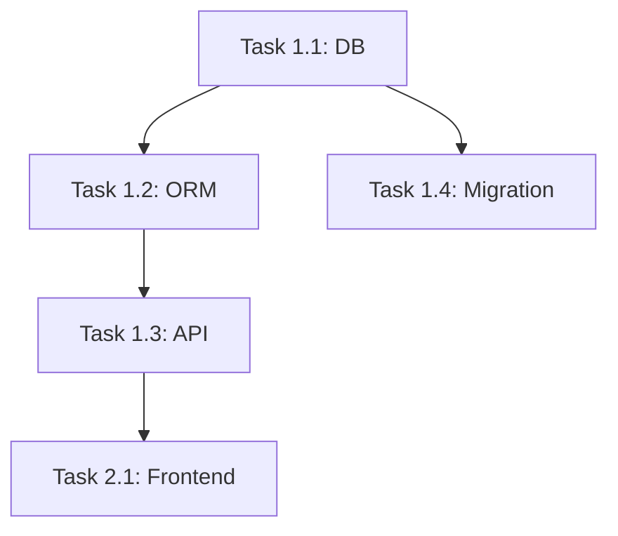

# Task Breakdown: [Feature/Phase Name]

---

## Meta
- PRD Reference: [PRD 파일명]
- Architecture Reference: [Architecture 파일명]
- Phase: [Phase 1 | Phase 2 | ...]
- Total Estimate: [총 예상 시간]
- Start Date: [시작 날짜]
- Target Date: [목표 날짜]
- Owner: [담당자]

---

## 1. Overview

<!--
이 Phase/Feature의 개요
- 무엇을 만드는가
- 왜 중요한가
- 핵심 가치
-->

---

## 2. Epic Breakdown

### Epic 1: [Epic Name]

**Goal**: [목표]

**User Stories**:
- As a [사용자], I want to [행동], So that [목적]

**Estimate**: [예상 시간 - 예: 1주]

**Deliverables**:
- [산출물 1]
- [산출물 2]

---

## 3. Tasks

### Task 1.1: [Task Name]

**Epic**: [Epic 1]

**Description**:
[무엇을 구현하는가]

**Acceptance Criteria**:
- [ ] [구체적 완료 기준 1]
- [ ] [구체적 완료 기준 2]
- [ ] [구체적 완료 기준 3]

**Technical Details**:
<!--
구현 힌트:
- 파일 생성: [파일명들]
- 주요 함수: [함수명들]
- 외부 의존성: [라이브러리들]
-->

**Test Strategy**:
- **Unit Tests**: [테스트 대상]
- **Integration Tests**: [통합 시나리오]
- **E2E Tests**: [전체 플로우]

**Definition of Done**:
- [ ] 코드 작성 완료
- [ ] 단위 테스트 작성 및 통과
- [ ] 통합 테스트 통과 (필요 시)
- [ ] 코드 리뷰 완료
- [ ] 문서화 (docstring, README)
- [ ] CI 테스트 통과
- [ ] Main 브랜치 병합

**Estimate**: [4-8시간]

**Priority**: P0 | P1 | P2

**Dependencies**:
- [Task X.X] (완료 필요)
- None

**Assigned To**: [담당자]

**Status**: Todo | In Progress | Review | Done

---

### Task 1.2: [Task Name]

**Epic**: [Epic 1]

**Description**:
[상세 설명]

**Acceptance Criteria**:
- [ ] [기준 1]
- [ ] [기준 2]

**Technical Details**:
[구현 상세]

**Test Strategy**:
- **Unit**: [내용]
- **Integration**: [내용]

**Definition of Done**:
- [ ] 코드 완료
- [ ] 테스트 통과
- [ ] 리뷰 완료
- [ ] 병합 완료

**Estimate**: [시간]

**Priority**: P0 | P1 | P2

**Dependencies**:
- Task 1.1 (완료 필요)

**Assigned To**: [담당자]

**Status**: Todo

---

### Task 1.3: [Task Name]

[위와 동일한 구조]

---

## 4. Epic 2: [Epic Name]

[Epic 1과 동일한 구조]

---

## 5. Task Dependency Graph

<!--
Task 간 의존성 시각화 (선택)
-->

```
Task 1.1 (DB 스키마)
  ↓
Task 1.2 (ORM 모델)
  ↓
Task 1.3 (API 엔드포인트)
  ↓
Task 2.1 (Frontend 컴포넌트)
```

또는 Mermaid:



---

## 6. Timeline

<!--
시간 기반 계획 (선택)
-->

### Week 1
- **Day 1**: Task 1.1, 1.2
- **Day 2**: Task 1.3
- **Day 3**: Task 1.4, 1.5
- **Day 4**: Task 2.1
- **Day 5**: Task 2.2, Review

### Week 2
- **Day 1-2**: Epic 2
- ...

---

## 7. Progress Tracking

<!--
진행 상황 추적 (선택)
-->

### Overall Progress

**Total**: [N] Tasks
**Completed**: [X] Tasks ([%]%)
**In Progress**: [Y] Tasks
**Remaining**: [Z] Tasks

### By Epic

**Epic 1**: 5/10 Tasks (50%)
- ✅ Task 1.1
- ✅ Task 1.2
- 🔄 Task 1.3 (In Progress)
- ⏳ Task 1.4
- ⏳ Task 1.5

**Epic 2**: 0/5 Tasks (0%)
- ⏳ Task 2.1
- ⏳ Task 2.2
- ...

---

## 8. Risks & Issues

<!--
발견된 리스크와 이슈 (업데이트)
-->

### Risks

**Risk 1**: [위험]
- **Impact**: High | Medium | Low
- **Probability**: High | Medium | Low
- **Mitigation**: [완화 방안]
- **Owner**: [담당자]

### Issues

**Issue 1**: [이슈]
- **Discovered**: [날짜]
- **Impact**: [영향]
- **Resolution**: [해결 방안]
- **Status**: Open | In Progress | Resolved

---

## 9. Learnings & Notes

<!--
구현 중 배운 점, 노트 (업데이트)
-->

- [날짜] - [배운 점 또는 중요 노트]
- [날짜] - [결정 사항]

---

## 10. Checklist (전체 Phase 완료 기준)

- [ ] 모든 P0 Task 완료
- [ ] 모든 테스트 통과
- [ ] 코드 리뷰 완료
- [ ] 문서화 완료
- [ ] PRD Acceptance Criteria 충족
- [ ] Performance 목표 달성
- [ ] Security 검토 완료
- [ ] Stakeholder Demo 완료

---

## 11. Retrospective

<!--
Phase 완료 후 회고 (완료 후 작성)
-->

### What Went Well
- [잘된 점]

### What Could Be Improved
- [개선 필요 사항]

### Action Items
- [다음 Phase에서 적용할 것]

---

## 12. Change Log

| Date | Author | Change | Reason |
|------|--------|--------|--------|
| [날짜] | [작성자] | Initial breakdown | Phase 1 시작 |
| [날짜] | [작성자] | Task 1.3 추가 | 요구사항 변경 |