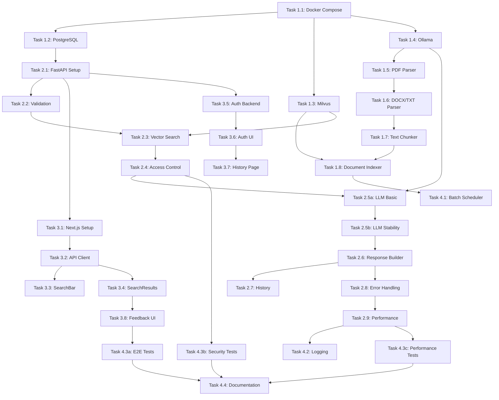

# Task Breakdown: RAG 기반 사내 정보 검색 플랫폼

---

## Meta
- PRD Reference: [docs/prd/rag-platform-prd.md](../prd/rag-platform-prd.md)
- Architecture Reference: [docs/architecture/architecture.md](../architecture/architecture.md)
- Tech Stack Reference: [docs/tech-stack/tech-stack.md](../tech-stack/tech-stack.md)
- Created: 2025-12-30
- Status: Draft
- Version: 1.1.0

---

## 1. Executive Summary

PRD와 Architecture를 기반으로 **실제 구현 가능한 작은 단위의 task**로 분해했습니다. 각 task는 **3-4시간 이내** 완료 가능하며, **독립적으로 테스트 및 검증 가능**합니다.

**핵심 원칙:**
- ✅ 작은 단위로 분해 (3-4시간, 최대 6시간)
- ✅ 단계별 검증 (테스트 케이스 명시)
- ✅ CLAUDE.md HARD RULE 준수 (보안 우선)
- ✅ Phase별 순차 진행 (의존성 관리)

**총 예상 기간:** 7-8주 (35-40 영업일)

---

## 2. Task Breakdown Overview

| Phase | 주요 목표 | Task 수 | 예상 기간 |
|-------|----------|---------|----------|
| **Phase 1** | 기본 인프라 구축 | 8개 | 2주 |
| **Phase 2** | 검색 및 응답 기능 | 10개 | 2주 |
| **Phase 3** | UI 및 사용자 기능 | 8개 | 2주 |
| **Phase 4** | 운영 및 개선 | 6개 | 1-2주 |
| **Total** | - | **32개** | **7-8주** |

---

## 3. Phase 1: 기본 인프라 구축 (2주)

### Goal
Docker Compose 환경 구축, PostgreSQL 및 Milvus 설정, 문서 처리 파이프라인 구현

### Prerequisites
- Docker 및 Docker Compose 설치
- Python 3.11+ 설치
- Git 설치

---

### Week 1: 개발 환경 및 DB 설정

#### **Task 1.1: 프로젝트 초기 구조 및 Docker Compose 설정**
- **시간**: 4시간
- **담당**: Infrastructure
- **작업 내용**:
  - 디렉토리 구조 생성:
    ```
    rag-platform/
    ├── frontend/
    ├── backend/
    ├── docs/
    ├── docker-compose.yml
    └── .env.example
    ```
  - `docker-compose.yml` 작성:
    - PostgreSQL 15
    - Milvus Standalone (etcd, MinIO 포함)
    - Ollama
    - Attu (Milvus Web UI)
  - 환경 변수 관리 (`.env`, `.env.example`)
  - **[HARD RULE]** 비밀번호 하드코딩 금지 (환경 변수 사용)
- **검증 기준**:
  - [ ] `docker-compose up -d` 성공
  - [ ] 모든 컨테이너 `running` 상태 확인
  - [ ] PostgreSQL 연결 테스트 (psql)
  - [ ] Attu UI 접속 가능 (http://localhost:8080)
- **출력물**:
  - `docker-compose.yml`
  - `.env.example`
  - `README.md` (설치 가이드)

---

#### **Task 1.2: PostgreSQL 스키마 및 마이그레이션 설정**
- **시간**: 4시간
- **담당**: Backend
- **작업 내용**:
  - SQLAlchemy 모델 정의:
    - `models/user.py` (Users)
    - `models/document.py` (Documents)
    - `models/search.py` (SearchQueries, SearchResponses)
    - `models/feedback.py` (UserFeedback)
  - Alembic 마이그레이션 설정
  - 초기 스키마 생성 스크립트 (`alembic revision --autogenerate`)
  - 인덱스 생성:
    - `idx_users_email`
    - `idx_documents_metadata` (GIN)
    - `idx_search_queries_user_id`
- **검증 기준**:
  - [ ] `alembic upgrade head` 성공
  - [ ] 모든 테이블 생성 확인 (psql)
  - [ ] 제약 조건 검증 (FK, INDEX)
  - [ ] 샘플 데이터 삽입 성공
- **출력물**:
  - `backend/app/models/` (모든 모델 파일)
  - `alembic/versions/` (마이그레이션 파일)
  - `backend/tests/test_models.py` (단위 테스트)

---

#### **Task 1.3: Milvus Collection 생성 및 연결 테스트**
- **시간**: 4시간
- **담당**: Backend
- **작업 내용**:
  - Milvus Python SDK 설정 (`pymilvus`)
  - Collection 스키마 정의:
    - 필드: `id`, `document_id`, `content`, `embedding` (768차원), `chunk_index`, `metadata`
    - 인덱스: HNSW (M=16, efConstruction=256)
    - 메트릭: COSINE
  - Collection 생성 스크립트
  - 연결 테스트 코드 작성
- **검증 기준**:
  - [ ] Collection 생성 성공
  - [ ] 더미 벡터 (5개) 저장 성공
  - [ ] 유사도 검색 테스트 성공
  - [ ] Attu UI에서 Collection 확인
- **출력물**:
  - `backend/app/db/milvus_client.py`
  - `backend/scripts/create_milvus_collection.py`
  - `backend/tests/test_milvus.py`

---

#### **Task 1.4: Ollama 설치 및 모델 다운로드**
- **시간**: 2시간
- **담당**: Infrastructure
- **작업 내용**:
  - Ollama 컨테이너 실행 (docker-compose 포함)
  - 모델 다운로드:
    ```bash
    docker exec -it ollama ollama pull llama3
    docker exec -it ollama ollama pull nomic-embed-text
    ```
  - LangChain Ollama 연동 테스트
  - Configuration 설계 (Ollama ↔ OpenAI 전환 가능)
- **검증 기준**:
  - [ ] `llama3` 모델 다운로드 완료
  - [ ] `nomic-embed-text` 모델 다운로드 완료
  - [ ] 테스트 프롬프트 실행 성공
  - [ ] 임베딩 생성 테스트 (768차원 벡터)
- **출력물**:
  - `backend/app/config.py` (LLM Provider 설정)
  - `backend/tests/test_ollama.py`

---

### Week 2: 문서 처리 파이프라인

#### **Task 1.5: 문서 파싱 모듈 구현 (PDF)**
- **시간**: 6시간
- **담당**: Backend
- **작업 내용**:
  - `pypdf` 또는 `pdfplumber`로 PDF 텍스트 추출
  - 페이지 번호 메타데이터 추출
  - 에러 핸들링:
    - 손상된 PDF 처리
    - 암호화된 PDF 경고
    - 빈 페이지 건너뛰기
  - **[HARD RULE]** 입력 검증 (파일 크기 제한 100MB)
- **테스트 케이스** (TDD):
  - **Happy Path**:
    - `test_valid_pdf_parsing()` - 정상 PDF 파싱
    - `test_page_number_extraction()` - 페이지 번호 추출
    - `test_multi_page_pdf()` - 다중 페이지 PDF
  - **Edge Cases**:
    - `test_empty_page_skip()` - 빈 페이지 건너뛰기
    - `test_large_pdf_handling()` - 대용량 PDF (100MB 한계)
    - `test_pdf_with_images_only()` - 이미지만 있는 PDF
  - **Error Handling**:
    - `test_corrupted_pdf_error()` - 손상된 PDF 에러 처리
    - `test_encrypted_pdf_warning()` - 암호화 PDF 경고
    - `test_file_size_limit_exceeded()` - 크기 제한 초과
  - **Security**:
    - `test_malicious_pdf_rejection()` - 악성 PDF 거부
- **검증 기준**:
  - [ ] 테스트 케이스 10개 모두 통과
  - [ ] 5개 샘플 PDF 파싱 성공
  - [ ] 텍스트 추출 정확도 확인 (수동 검증)
  - [ ] 에러 케이스 처리 확인
- **출력물**:
  - `backend/app/services/document_parser/pdf_parser.py`
  - `backend/tests/test_pdf_parser.py` (10개 테스트 케이스)
  - 샘플 PDF 파일 5개 (`backend/tests/fixtures/`)

---

#### **Task 1.6: 문서 파싱 모듈 구현 (DOCX, TXT, Markdown)**
- **시간**: 4시간
- **담당**: Backend
- **작업 내용**:
  - `python-docx`로 DOCX 파싱
  - TXT 파일 읽기 (UTF-8 인코딩)
  - Markdown 파일 읽기
  - 통합 파서 인터페이스 설계 (`DocumentParser` 추상 클래스)
  - **[HARD RULE]** 파일 타입 검증 (확장자 + MIME 타입)
- **검증 기준**:
  - [ ] DOCX 파싱 성공 (3개 샘플)
  - [ ] TXT 파싱 성공 (3개 샘플)
  - [ ] Markdown 파싱 성공 (3개 샘플)
  - [ ] 잘못된 파일 타입 거부 확인
- **출력물**:
  - `backend/app/services/document_parser/docx_parser.py`
  - `backend/app/services/document_parser/text_parser.py`
  - `backend/app/services/document_parser/base_parser.py`
  - 샘플 파일 (각 타입별 3개)

---

#### **Task 1.7: 텍스트 청크 분할 로직 구현**
- **시간**: 4시간
- **담당**: Backend
- **작업 내용**:
  - LangChain `RecursiveCharacterTextSplitter` 사용
  - 청크 설정:
    - `chunk_size=500` (약 125 토큰)
    - `chunk_overlap=50` (컨텍스트 유지)
  - 청크 메타데이터 유지:
    - `document_id`, `chunk_index`, `document_title`, `page_number`
  - 단위 테스트 작성
- **검증 기준**:
  - [ ] 청크 크기 검증 (평균 500자 ± 10%)
  - [ ] Overlap 검증 (50자)
  - [ ] 메타데이터 유지 확인
  - [ ] 단위 테스트 통과 (10개 케이스)
- **출력물**:
  - `backend/app/services/text_chunker.py`
  - `backend/tests/test_text_chunker.py`

---

#### **Task 1.8: 문서 임베딩 및 Milvus 저장**
- **시간**: 6시간
- **담당**: Backend
- **작업 내용**:
  - Ollama `nomic-embed-text`로 청크 임베딩 생성
  - Milvus에 벡터 + 메타데이터 저장
  - 배치 처리 (5개 문서 병렬)
  - 문서 메타데이터 PostgreSQL 저장
  - 에러 처리:
    - 임베딩 생성 실패 → 재시도 3회
    - Milvus 저장 실패 → 롤백
- **검증 기준**:
  - [ ] 10개 테스트 문서 인덱싱 성공
  - [ ] Attu UI에서 벡터 확인
  - [ ] PostgreSQL에 메타데이터 저장 확인
  - [ ] 임베딩 차원 검증 (768차원)
- **출력물**:
  - `backend/app/services/document_indexer.py`
  - `backend/tests/test_document_indexer.py`
  - 통합 테스트 스크립트

---

## 4. Phase 2: 검색 및 응답 기능 (2주)

### Goal
RAG 파이프라인 구현, 자연어 검색 API, 권한 기반 필터링, LLM 답변 생성

---

### Week 3: RAG 파이프라인 구현

#### **Task 2.1: FastAPI 기본 구조 및 라우터 설정**
- **시간**: 4시간
- **담당**: Backend
- **작업 내용**:
  - FastAPI 앱 초기화 (`main.py`)
  - 라우터 설정:
    - `routers/search.py` (검색 API)
    - `routers/documents.py` (문서 API)
    - `routers/users.py` (사용자 API)
    - `routers/health.py` (Health check)
  - CORS 설정 (프론트엔드 허용)
  - Middleware 설정 (로깅, 타임아웃)
  - **[HARD RULE]** 비밀키 환경 변수 관리
- **검증 기준**:
  - [ ] FastAPI 서버 실행 성공 (`uvicorn app.main:app`)
  - [ ] API 문서 접근 가능 (`/docs`, `/redoc`)
  - [ ] Health check 응답 (`GET /health` → 200 OK)
  - [ ] CORS 설정 확인
- **출력물**:
  - `backend/app/main.py`
  - `backend/app/routers/` (모든 라우터 파일)
  - `backend/app/middleware/` (미들웨어)

---

#### **Task 2.2: 검색어 전처리 및 유효성 검증**
- **시간**: 3시간
- **담당**: Backend
- **작업 내용**:
  - Pydantic 스키마 정의:
    - `SearchQueryRequest` (query, user_id, limit, session_id)
    - `SearchQueryResponse` (query_id, answer, sources, response_time_ms)
  - 검색어 검증:
    - 길이: 5-200자
    - 특수문자 필터링 (SQL Injection 방지)
    - 빈 값 거부
  - **[HARD RULE]** 입력 검증 철저히 (Pydantic Validator)
- **검증 기준**:
  - [ ] 유효한 검색어 통과
  - [ ] 4자 이하 검색어 거부 (400 에러)
  - [ ] 201자 이상 검색어 거부
  - [ ] 특수문자 필터링 확인
  - [ ] 단위 테스트 통과 (10개 케이스)
- **출력물**:
  - `backend/app/schemas/search.py`
  - `backend/tests/test_search_validation.py`

---

#### **Task 2.3: 벡터 검색 기능 구현**
- **시간**: 6시간
- **담당**: Backend
- **작업 내용**:
  - 쿼리 임베딩 생성 (Ollama `nomic-embed-text`)
  - Milvus 유사도 검색:
    - 상위 5개 청크 검색
    - COSINE 유사도
    - ef=64 (검색 범위)
  - 관련도 점수 반환 (0-1)
  - 성능 측정 (검색 시간 < 1초 목표)
- **검증 기준**:
  - [ ] 테스트 쿼리 5개 실행 성공
  - [ ] 검색 결과 정확도 확인 (수동 검증)
  - [ ] 검색 시간 P95 < 1초
  - [ ] 관련도 점수 정렬 확인 (내림차순)
- **출력물**:
  - `backend/app/services/vector_search.py`
  - `backend/tests/test_vector_search.py`
  - 성능 측정 결과 로그

---

#### **Task 2.4: 권한 기반 필터링 로직**
- **시간**: 6시간
- **담당**: Backend
- **작업 내용**:
  - 사용자 `access_level` 확인 (L1, L2, L3)
  - Milvus 필터 표현식 생성:
    ```python
    filter_expr = f"access_level <= {user.access_level}"
    if user.department != "Management":
        filter_expr += f" and (department == '{user.department}' or access_level == 1)"
    ```
  - 부서별 필터링 로직
  - **[HARD RULE]** 권한 없는 문서 절대 노출 금지
- **검증 기준**:
  - [ ] L1 사용자 → L2, L3 문서 제외 확인
  - [ ] 부서 외 문서 제외 확인 (L2 이상)
  - [ ] Management 부서 → 모든 문서 접근 확인
  - [ ] 통합 테스트 통과 (5개 시나리오)
- **출력물**:
  - `backend/app/services/access_control.py`
  - `backend/tests/test_access_control.py`

---

#### **Task 2.5a: LLM 기본 답변 생성**
- **시간**: 4시간
- **담당**: Backend
- **작업 내용**:
  - LangChain RAG Chain 기본 구현:
    1. 쿼리 전처리
    2. 컨텍스트 구성 (검색 결과 → 프롬프트 컨텍스트)
    3. 프롬프트 템플릿 작성
    4. LLM 답변 생성
  - 프롬프트 템플릿:
    ```
    다음 문서를 참고하여 질문에 답변하세요.
    문서:
    {context}

    질문: {query}

    반드시 출처를 명시하세요. 문서에 없는 내용은 답하지 마세요.
    ```
  - Context 길이 최적화 (토큰 제한)
  - 기본 테스트 (3개 샘플 질문)
- **검증 기준**:
  - [ ] 3개 테스트 질문 답변 생성 성공
  - [ ] 프롬프트 템플릿 정상 작동
  - [ ] Context 구성 확인 (상위 5개 청크)
  - [ ] **품질 평가 실험** (Ollama vs 기대 품질)
    - 샘플 5개 테스트
    - Ollama 품질 수용 가능 여부 판단
    - 필요 시 Task 2.5b 전에 OpenAI 전환 결정
- **출력물**:
  - `backend/app/services/rag_service.py` (기본 버전)
  - `backend/tests/test_rag_basic.py`
  - 품질 평가 리포트

---

#### **Task 2.5b: LLM 안정성 강화**
- **시간**: 4시간
- **담당**: Backend
- **작업 내용**:
  - Hallucination 방지 로직:
    - Confidence score < 0.5 → "답변을 찾을 수 없습니다"
    - 출처 없는 답변 금지
    - 프롬프트에 "문서에 없는 내용 답변 금지" 명시
  - 타임아웃 처리 (30초)
  - 재시도 로직 (exponential backoff: 1초, 2초, 4초)
  - 에러 핸들링 완성
  - **[HARD RULE]** 검색된 문서만 사용 (Hallucination 절대 금지)
  - 통합 테스트
- **검증 기준**:
  - [ ] 5개 테스트 질문 모두 통과
  - [ ] 답변 품질 확인 (수동 검증)
  - [ ] 출처 정확도 100% (모든 답변에 출처 명시)
  - [ ] 타임아웃 테스트 (30초 초과 → 에러)
  - [ ] Hallucination 방지 확인 (confidence < 0.5)
  - [ ] 재시도 로직 확인
- **출력물**:
  - `backend/app/services/rag_service.py` (완성 버전)
  - `backend/tests/test_rag_service.py` (통합 테스트)
  - 프롬프트 템플릿 파일

---

### Week 4: API 완성 및 통합

#### **Task 2.6: 출처 추적 및 응답 구성**
- **시간**: 4시간
- **담당**: Backend
- **작업 내용**:
  - 검색된 문서 정보 추출:
    - `document_id`, `document_title`, `document_source`
    - `chunk_content`, `page_number`, `relevance_score`
  - `SearchResponse` 스키마 완성
  - 응답 시간 측정 (ms 단위)
  - JSON 응답 구성
- **검증 기준**:
  - [ ] API 응답 형식 검증 (JSON 스키마)
  - [ ] 출처 리스트 정확도 확인
  - [ ] 응답 시간 측정 확인
  - [ ] Pydantic 스키마 검증 통과
- **출력물**:
  - `backend/app/schemas/search.py` (응답 스키마)
  - `backend/tests/test_search_response.py`

---

#### **Task 2.7: 검색 히스토리 저장**
- **시간**: 3시간
- **담당**: Backend
- **작업 내용**:
  - PostgreSQL에 저장:
    - `search_queries` 테이블 (query, user_id, session_id, timestamp)
    - `search_responses` 테이블 (query_id, answer, sources, response_time_ms)
  - 사용자별 히스토리 조회 API:
    - `GET /api/v1/users/me/history`
    - 페이지네이션 (page, page_size)
  - 90일 보관 정책 (배치 작업은 Phase 4)
- **검증 기준**:
  - [ ] DB에 검색 기록 저장 확인
  - [ ] 히스토리 조회 API 테스트 (페이지네이션)
  - [ ] 사용자별 필터링 확인
  - [ ] JSONB 필드 저장 확인 (sources)
- **출력물**:
  - `backend/app/routers/users.py` (히스토리 API)
  - `backend/app/repositories/search_repository.py`
  - `backend/tests/test_search_history.py`

---

#### **Task 2.8: 에러 핸들링 및 Fallback**
- **시간**: 4시간
- **담당**: Backend
- **작업 내용**:
  - LLM 타임아웃 → Fallback:
    - 검색 결과만 반환 (답변 생성 없이)
    - 메시지: "답변 생성에 실패했습니다. 아래 검색 결과를 참고하세요."
  - Milvus 연결 실패 → 재시도 로직:
    - 3회 재시도 (exponential backoff: 1초, 2초, 4초)
  - 에러 응답 표준화:
    - 400: Bad Request (잘못된 검색어)
    - 401: Unauthorized (인증 실패)
    - 404: Not Found (답변 없음)
    - 500: Internal Server Error (서버 오류)
    - 504: Gateway Timeout (30초 초과)
  - **[HARD RULE]** 에러 메시지에 민감 정보 포함 금지
- **검증 기준**:
  - [ ] LLM 타임아웃 시뮬레이션 → Fallback 확인
  - [ ] Milvus 연결 실패 → 재시도 확인
  - [ ] 에러 코드 일관성 확인
  - [ ] 에러 응답 JSON 스키마 검증
- **출력물**:
  - `backend/app/middleware/error_handler.py`
  - `backend/tests/test_error_handling.py`

---

#### **Task 2.9: 성능 최적화 및 로깅**
- **시간**: 4시간
- **담당**: Backend
- **작업 내용**:
  - 응답 시간 로깅 (`structlog`):
    ```python
    logger.info(
        "search_request",
        user_id=user.id,
        query=query,
        response_time_ms=response_time,
        sources_count=len(sources)
    )
    ```
  - 컴포넌트별 시간 측정:
    - 벡터 검색 시간
    - LLM 호출 시간
    - DB 저장 시간
  - 성능 최적화:
    - DB Connection Pool 설정
    - 비동기 처리 (`async/await`)
  - **[HARD RULE]** 로그에 개인정보 마스킹 (이메일, 민감 검색어)
- **검증 기준**:
  - [ ] 응답 시간 P95 < 30초 달성
  - [ ] 로그 파일 확인 (JSON 포맷)
  - [ ] 개인정보 마스킹 확인
  - [ ] 성능 프로파일링 결과 문서화
- **출력물**:
  - `backend/app/utils/logger.py`
  - `backend/tests/test_performance.py`
  - 성능 측정 리포트

---

## 5. Phase 3: UI 및 사용자 기능 (2주)

### Goal
Next.js 14 프론트엔드 구현, 검색 UI, 인증, 히스토리, 피드백 기능

---

### Week 5: Frontend 기본 구조

#### **Task 3.1: Next.js 14 프로젝트 초기화**
- **시간**: 3시간
- **담당**: Frontend
- **작업 내용**:
  - Next.js 14 App Router 설정
  - TypeScript, Tailwind CSS, ESLint, Prettier 설정
  - 디렉토리 구조 생성:
    ```
    frontend/
    ├── app/
    │   ├── layout.tsx
    │   ├── page.tsx
    │   ├── search/
    │   ├── history/
    │   └── document/
    ├── components/
    ├── lib/
    └── store/
    ```
  - shadcn/ui 설치 및 설정
- **검증 기준**:
  - [ ] 개발 서버 실행 성공 (`npm run dev`)
  - [ ] TypeScript strict mode 활성화
  - [ ] Tailwind CSS 작동 확인
  - [ ] 빌드 성공 (`npm run build`)
- **출력물**:
  - `frontend/package.json`
  - `frontend/tsconfig.json`
  - `frontend/tailwind.config.ts`

---

#### **Task 3.2: API 클라이언트 및 React Query 설정**
- **시간**: 4시간
- **담당**: Frontend
- **작업 내용**:
  - Axios API 클라이언트 구성:
    - Base URL 설정 (`NEXT_PUBLIC_API_URL`)
    - 인터셉터 (토큰 자동 추가, 에러 처리)
  - React Query 설정:
    - QueryClient 구성 (캐싱, 리프레시)
    - QueryClientProvider
  - API 엔드포인트 타입 정의 (TypeScript)
  - 테스트 API 호출
- **검증 기준**:
  - [ ] Health check API 호출 성공
  - [ ] 토큰 자동 추가 확인
  - [ ] React Query 캐싱 확인
  - [ ] 에러 처리 확인 (401, 500)
- **출력물**:
  - `frontend/lib/api-client.ts`
  - `frontend/lib/query-client.ts`
  - `frontend/types/api.ts`

---

#### **Task 3.3: SearchBar 컴포넌트 구현**
- **시간**: 4시간
- **담당**: Frontend
- **작업 내용**:
  - 검색 입력 UI (Tailwind CSS + shadcn/ui):
    - Input 필드
    - 검색 버튼
    - 로딩 스피너
  - 입력 검증:
    - 5-200자 제한
    - 실시간 검증 (빨간색 테두리)
  - 검색 버튼 클릭 → API 호출
  - **[SOFT RULE]** 사용자 경험 최적화 (디바운싱)
- **검증 기준**:
  - [ ] UI 렌더링 확인
  - [ ] 입력 검증 확인 (4자 → 빨간색)
  - [ ] 검색 버튼 클릭 → API 호출 확인
  - [ ] 로딩 상태 표시 확인
- **출력물**:
  - `frontend/components/SearchBar.tsx`
  - `frontend/components/ui/` (shadcn/ui 컴포넌트)

---

#### **Task 3.4: SearchResults 컴포넌트 구현**
- **시간**: 6시간
- **담당**: Frontend
- **작업 내용**:
  - 답변 표시 UI:
    - 답변 텍스트 (Markdown 렌더링)
    - 응답 시간 표시
  - 출처 문서 리스트:
    - 문서 제목, 링크, 페이지 번호
    - 관련도 점수 (프로그레스 바)
  - 로딩/에러 상태 처리:
    - 로딩 스켈레톤
    - 에러 메시지 (빨간색 알림)
  - **[SOFT RULE]** 접근성 (ARIA 레이블)
- **검증 기준**:
  - [ ] 실제 검색 결과 렌더링 확인
  - [ ] Markdown 렌더링 확인
  - [ ] 출처 링크 클릭 가능 확인
  - [ ] 로딩/에러 상태 확인
- **출력물**:
  - `frontend/components/SearchResults.tsx`
  - `frontend/components/SourceList.tsx`

---

### Week 6: 인증 및 추가 기능

#### **Task 3.5: Mock 인증 시스템 구현**
- **시간**: 6시간
- **담당**: Backend + Frontend
- **작업 내용**:
  - **Backend**:
    - JWT 토큰 생성 (`/api/v1/auth/login`)
    - 토큰 검증 Middleware
    - 로그아웃 API (`/api/v1/auth/logout`)
    - **[HARD RULE]** JWT Secret 환경 변수 관리
  - **Frontend**:
    - 로그인 API 호출
    - httpOnly Cookie에 토큰 저장
    - 토큰 자동 갱신 (Refresh Token)
- **검증 기준**:
  - [ ] 로그인 → 토큰 발급 성공
  - [ ] 보호된 API 호출 성공 (토큰 포함)
  - [ ] 토큰 만료 → 401 에러 확인
  - [ ] 로그아웃 → 토큰 삭제 확인
- **출력물**:
  - `backend/app/routers/auth.py`
  - `backend/app/middleware/auth_middleware.py`
  - `frontend/lib/auth.ts`

---

#### **Task 3.6: 인증 Provider 및 UI**
- **시간**: 4시간
- **담당**: Frontend
- **작업 내용**:
  - Next.js 인증 Provider (Context API)
  - 로그인 페이지 UI (`/login`)
  - 로그아웃 버튼
  - 보호된 라우트 (미인증 → 로그인 페이지 리다이렉트)
- **검증 기준**:
  - [ ] 로그인 페이지 렌더링
  - [ ] 로그인 성공 → 홈으로 리다이렉트
  - [ ] 로그아웃 → 로그인 페이지로 리다이렉트
  - [ ] 보호된 라우트 접근 차단 확인
- **출력물**:
  - `frontend/app/login/page.tsx`
  - `frontend/lib/auth-provider.tsx`
  - `frontend/components/LogoutButton.tsx`

---

#### **Task 3.7: 검색 히스토리 페이지**
- **시간**: 4시간
- **담당**: Frontend
- **작업 내용**:
  - 히스토리 조회 API 연동 (`GET /api/v1/users/me/history`)
  - 히스토리 리스트 UI:
    - 검색어, 타임스탬프, 평점
    - 클릭 → 검색 결과 다시 표시
  - 페이지네이션 (10개씩)
  - 빈 상태 처리 ("검색 기록이 없습니다")
- **검증 기준**:
  - [ ] 히스토리 리스트 렌더링 확인
  - [ ] 페이지네이션 동작 확인
  - [ ] 히스토리 클릭 → 검색 결과 표시
  - [ ] 빈 상태 UI 확인
- **출력물**:
  - `frontend/app/history/page.tsx`
  - `frontend/components/HistoryList.tsx`

---

#### **Task 3.8: 사용자 피드백 수집 UI**
- **시간**: 4시간
- **담당**: Frontend
- **작업 내용**:
  - 만족도 평가 컴포넌트 (1-5점 별점)
  - 피드백 저장 API 연동 (`POST /api/v1/feedback`)
  - 댓글 입력 (선택적)
  - 피드백 성공 → Toast 알림
- **검증 기준**:
  - [ ] 별점 UI 렌더링 확인
  - [ ] 평가 저장 → DB 확인
  - [ ] 댓글 저장 확인
  - [ ] Toast 알림 표시 확인
- **출력물**:
  - `frontend/components/FeedbackForm.tsx`
  - `backend/app/routers/feedback.py`

---

## 6. Phase 4: 운영 및 개선 (1-2주)

### Goal
배치 작업, 모니터링, 테스트, 문서화

---

### Week 7: 배치 작업 및 모니터링

#### **Task 4.1: 문서 자동 인덱싱 배치 스케줄러**
- **시간**: 6시간
- **담당**: Backend
- **작업 내용**:
  - Python 스케줄러 (APScheduler)
  - 신규 문서 감지 (문서 저장소 폴링)
  - 자동 인덱싱 (Task 1.8 재사용)
  - 일 1회 자동 실행 (새벽 2시)
  - 수동 트리거 API (`POST /api/v1/admin/index`)
  - 실패 시 재시도 (3회)
- **검증 기준**:
  - [ ] 스케줄러 실행 확인
  - [ ] 신규 문서 인덱싱 성공
  - [ ] 배치 로그 확인 (성공/실패)
  - [ ] 수동 트리거 API 테스트
- **출력물**:
  - `backend/app/scheduler/indexing_scheduler.py`
  - `backend/app/routers/admin.py`
  - 배치 로그 파일

---

#### **Task 4.2: 기본 모니터링 로그 설정**
- **시간**: 4시간
- **담당**: Backend
- **작업 내용**:
  - 구조화된 로그 (`structlog`)
  - 로그 레벨:
    - ERROR: LLM 실패, DB 실패
    - WARNING: 응답 시간 > 25초
    - INFO: 모든 검색 요청
    - DEBUG: 상세 디버깅 (개발 환경만)
  - 로그 보관 정책:
    - 검색 로그: 90일
    - 에러 로그: 1년
  - **[HARD RULE]** 개인정보 마스킹 (이메일, 민감 검색어)
- **검증 기준**:
  - [ ] 로그 파일 생성 확인 (JSON 포맷)
  - [ ] 로그 레벨 필터링 확인
  - [ ] 개인정보 마스킹 확인
  - [ ] 로그 로테이션 설정 확인
- **출력물**:
  - `backend/app/utils/logger.py`
  - 로그 설정 파일 (`logging.yaml`)

---

#### **Task 4.3a: E2E 테스트 작성**
- **시간**: 4시간
- **담당**: Frontend + Backend
- **작업 내용**:
  - Playwright 설정
  - E2E 시나리오:
    - 로그인 → 검색 → 결과 확인
    - 검색 히스토리 조회
    - 피드백 제출
    - 로그아웃
  - 테스트 데이터 준비
- **검증 기준**:
  - [ ] Playwright 설치 및 설정 완료
  - [ ] E2E 테스트 5개 시나리오 통과
  - [ ] 스크린샷 캡처 (실패 시)
  - [ ] 테스트 리포트 생성
- **출력물**:
  - `frontend/tests/e2e/search.spec.ts`
  - `frontend/tests/e2e/history.spec.ts`
  - Playwright 설정 파일

---

#### **Task 4.3b: 권한 및 보안 테스트**
- **시간**: 3시간
- **담당**: Backend
- **작업 내용**:
  - **권한 테스트** (10개 케이스):
    - L1 사용자 → L2 문서 접근 차단
    - L1 사용자 → L3 문서 접근 차단
    - L2 사용자 → 부서 외 문서 접근 차단
    - L2 사용자 → 부서 내 L2 문서 접근 허용
    - Management 부서 → 모든 문서 접근 허용
    - 미인증 사용자 → 모든 API 차단
    - 토큰 만료 → 401 에러
    - 잘못된 토큰 → 401 에러
    - 권한 없는 관리자 API → 403 에러
    - 문서 삭제 권한 확인
  - **보안 테스트**:
    - SQL Injection 공격 방어
    - XSS 공격 방어
    - CSRF 공격 방어
    - 비밀번호 하드코딩 확인 (grep)
    - 환경 변수 노출 확인
- **검증 기준**:
  - [ ] 권한 테스트 10개 케이스 모두 통과
  - [ ] 보안 테스트 취약점 없음
  - [ ] 보안 스캔 리포트 생성
- **출력물**:
  - `backend/tests/integration/test_access_control.py`
  - `backend/tests/security/test_security.py`
  - 보안 테스트 리포트

---

#### **Task 4.3c: 성능 테스트**
- **시간**: 3시간
- **담당**: Backend + Infrastructure
- **작업 내용**:
  - **응답 시간 테스트**:
    - 100회 검색 요청 실행
    - P50, P95, P99 측정
    - 목표: P95 < 30초
  - **동시 사용자 테스트**:
    - Locust 또는 k6 사용
    - 동시 사용자 100명 시뮬레이션
    - 에러율 측정 (목표: < 1%)
  - **부하 테스트 리포트**:
    - 응답 시간 그래프
    - 에러율 그래프
    - 병목 지점 분석
- **검증 기준**:
  - [ ] 응답 시간 P95 < 30초 달성
  - [ ] 동시 사용자 100명 처리 성공
  - [ ] 에러율 < 1%
  - [ ] 성능 테스트 리포트 생성
- **출력물**:
  - `backend/tests/performance/test_load.py`
  - `backend/tests/performance/locustfile.py`
  - 성능 테스트 리포트

---

#### **Task 4.4: README 및 운영 문서 작성**
- **시간**: 4시간
- **담당**: All
- **작업 내용**:
  - 프로젝트 README:
    - 프로젝트 개요
    - 설치 방법 (`docker-compose up -d`)
    - 환경 변수 설정 (`.env.example`)
    - 실행 방법
  - 운영 문서:
    - 배치 작업 스케줄
    - 로그 위치 및 확인 방법
    - 트러블슈팅 가이드
    - 문서 인덱싱 가이드
  - API 문서 (FastAPI 자동 생성 활용)
- **검증 기준**:
  - [ ] 새로운 팀원이 README만으로 실행 가능
  - [ ] 환경 변수 설정 가이드 명확성
  - [ ] 트러블슈팅 가이드 유용성
  - [ ] API 문서 완성도
- **출력물**:
  - `README.md`
  - `docs/operations/deployment-guide.md`
  - `docs/operations/troubleshooting.md`

---

## 7. Task Dependencies (Dependency Graph)



---

## 8. Risk Mitigation

### 8.1 Technical Risks

#### **Risk 1: Ollama 품질 부족**
- **Impact**: 답변 품질 저하 → 사용자 만족도 하락
- **Probability**: Medium (40%)
- **Mitigation**:
  1. **Task 2.5a에서 LLM Provider 추상화**
     - Interface: `BaseLLMProvider`
     - Implementation: `OllamaProvider`, `OpenAIProvider`
     - Configuration 전환: `LLM_PROVIDER` 환경 변수
  2. **품질 비교 실험 (Task 2.5a 완료 시)**
     - 샘플 쿼리 20개 준비
     - 평가 기준: 정확도, 관련성, 유창성
     - 수동 평가 + 자동 평가 (ROUGE, BLEU)
  3. **전환 시나리오**:
     - Step 1: OpenAI API 키 준비 (`.env`)
     - Step 2: 환경 변수 변경: `LLM_PROVIDER=openai`
     - Step 3: 재시작 (`docker-compose restart backend`)
     - 재배포 불필요 (Configuration 전환만)
- **Owner**: Backend Lead
- **Review Date**: Phase 2 Week 3 (Task 2.5a 완료 시)

---

#### **Risk 2: 응답 시간 목표 미달 (P95 > 30초)**
- **Impact**: NFR 미달 → 사용자 이탈
- **Probability**: Medium (30%)
- **Mitigation**:
  1. **Task 2.9에서 성능 프로파일링**
     - 벡터 검색 시간 측정 (목표: < 1초)
     - LLM 호출 시간 측정 (목표: < 25초)
     - DB 저장 시간 측정 (목표: < 0.5초)
  2. **병목 지점 최적화 우선순위**:
     - a) LLM 타임아웃 → 25초로 단축
     - b) 벡터 검색 HNSW 파라미터 튜닝 (ef: 64 → 32)
     - c) Context 길이 축소 (토큰 절약)
     - d) DB Connection Pool 증가
  3. **Fallback 전략**:
     - LLM 타임아웃 → 검색 결과만 반환 (답변 생성 스킵)
     - 메시지: "답변 생성에 실패했습니다. 검색 결과를 참고하세요."
  4. **최종 대응**:
     - Ollama → OpenAI 전환 (응답 속도 3배 향상)
     - Configuration 전환만으로 즉시 적용 가능
- **Owner**: Backend Lead
- **Review Date**: Phase 2 Week 4 (Task 2.9 완료 시)

---

#### **Risk 3: 보안 취약점**
- **Impact**: 보안 사고 → 데이터 유출, 규정 위반
- **Probability**: Low (10%, 적절한 통제 시)
- **Mitigation**:
  1. **모든 Task에서 CLAUDE.md HARD RULE 준수**
     - 비밀번호 하드코딩 금지
     - 환경 변수 사용 (`JWT_SECRET`, `DATABASE_URL`)
     - 입력 검증 (Pydantic Validator)
     - 권한 확인 (모든 API)
  2. **Task 4.3b에서 보안 테스트**
     - SQL Injection 공격 시뮬레이션
     - XSS 공격 시뮬레이션
     - CSRF 토큰 검증
     - 비밀번호 하드코딩 스캔 (`grep -r "password" --exclude-dir=node_modules`)
  3. **정기 보안 감사**:
     - 월 1회 보안 스캔 (OWASP ZAP)
     - 분기 1회 침투 테스트
- **Owner**: Security Team
- **Review Date**: Phase 4 (Task 4.3b 완료 시)

---

## 9. Success Criteria

### Phase 1 완료 조건:
- [ ] **문서 인덱싱 성공**
  - 10개 테스트 문서 인덱싱 완료
  - Milvus에 벡터 저장 확인 (Attu UI)
  - PostgreSQL에 메타데이터 저장 확인 (psql)
- [ ] **Ollama 모델 정상 동작**
  - `llama3` 답변 생성 테스트 성공
  - `nomic-embed-text` 임베딩 생성 테스트 성공 (768차원)

---

### Phase 2 완료 조건:
- [ ] **자연어 검색 API 정상 동작**
  - 테스트 케이스 15개 모두 통과
  - 에러율 < 1% (100회 실행 기준)
- [ ] **응답 시간 P95 < 30초**
  - 100회 테스트 실행
  - 95회 이상 30초 이내 응답
  - 성능 프로파일링 리포트 작성
- [ ] **출처 정확도 100%**
  - 샘플 50개 검증
  - 모든 출처 링크 유효 (HTTP 200)
  - 모든 답변에 출처 명시
- [ ] **권한 필터링 정상 동작**
  - 권한 테스트 10개 케이스 통과
  - L1 사용자 → L2 문서 접근 차단 확인
  - 부서 외 문서 접근 차단 확인

---

### Phase 3 완료 조건:
- [ ] **E2E 테스트 통과**
  - Acceptance Test 5개 시나리오 모두 통과:
    1. 사용자가 "연차 사용 방법" 검색 → 정확한 답변 + 출처
    2. 사용자가 "존재하지 않는 정보" 검색 → "답변을 찾을 수 없습니다"
    3. L1 사용자가 L2 문서 검색 → 결과에서 제외
    4. 응답 시간 측정 → 30초 이내
    5. 답변에 출처 링크 5개 포함 → 모두 유효
- [ ] **사용자 피드백 수집 기능 동작**
  - 만족도 평가 저장 성공
  - DB에 피드백 기록 확인
- [ ] **검색 히스토리 조회 가능**
  - 히스토리 API 테스트 통과
  - 페이지네이션 동작 확인

---

### Phase 4 완료 조건:
- [ ] **배치 작업 안정화**
  - 스케줄러 일 1회 정상 실행 (3일 연속)
  - 신규 문서 자동 인덱싱 성공
- [ ] **통합 테스트 통과 (모든 시나리오)**
  - E2E 테스트 통과 (Task 4.3a)
  - 보안 테스트 취약점 없음 (Task 4.3b)
  - 성능 테스트 P95 < 30초 (Task 4.3c)
- [ ] **운영 문서 완성**
  - README.md 완성
  - 트러블슈팅 가이드 완성
  - API 문서 완성
- [ ] **새로운 팀원이 README만으로 실행 가능**
  - 신규 팀원 2명에게 테스트
  - 30분 이내 실행 성공

---

## 10. Next Steps

1. **Phase 1 Task 1.1부터 시작**
2. **각 Task 완료 후 검증 기준 충족 확인**
3. **Task 완료 시 다음 Task로 진행**
4. **Phase별 완료 후 리뷰 및 승인**

---

## 11. Change Log

| Date | Version | Author | Changes |
|------|---------|--------|---------|
| 2025-12-30 | 1.0.0 | Task Breaker | Initial task breakdown |
| 2025-12-30 | 1.1.0 | Task Breaker | 개선 사항 반영: Task 분해 (2.5, 4.3), 테스트 구체화, Success Criteria 정량화, Risk Mitigation 상세화 |

---

## 12. Approval

- [ ] Technical Lead
- [ ] Backend Team
- [ ] Frontend Team
- [ ] Infrastructure Team

**Review Deadline**: 2026-01-03
**Implementation Start**: After approval

---

**END OF TASK BREAKDOWN DOCUMENT**
